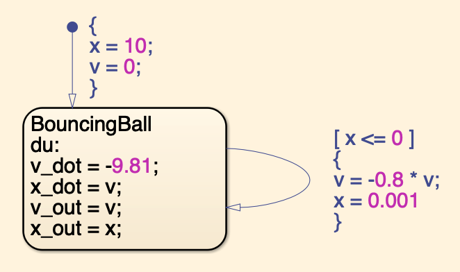
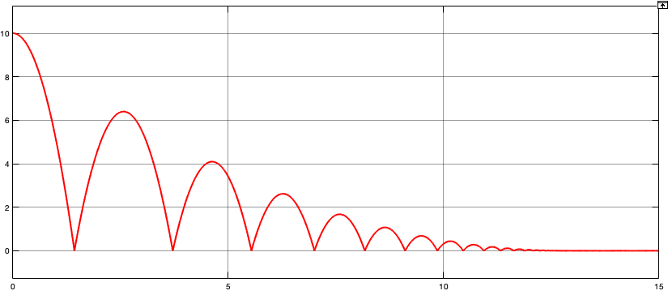
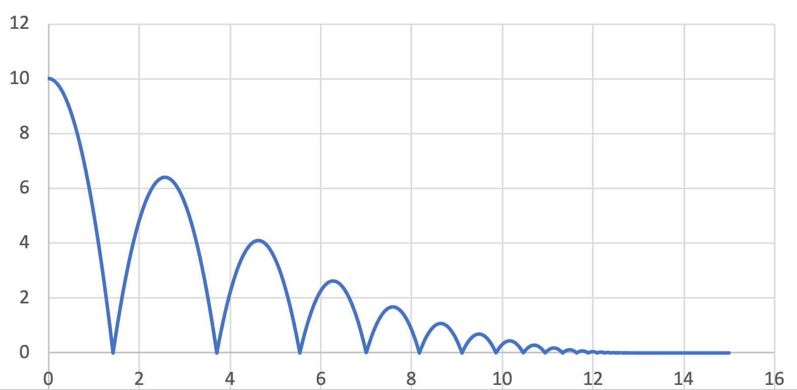
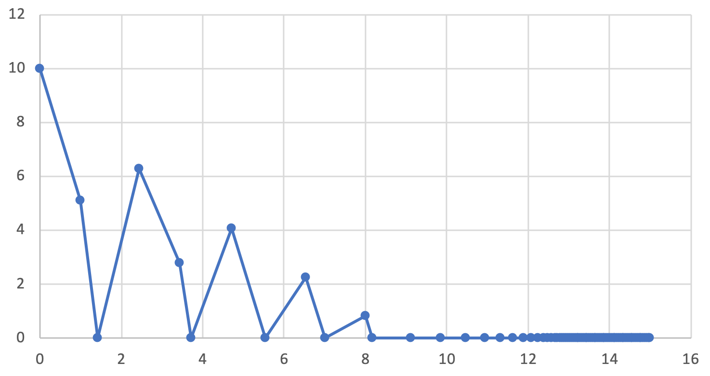
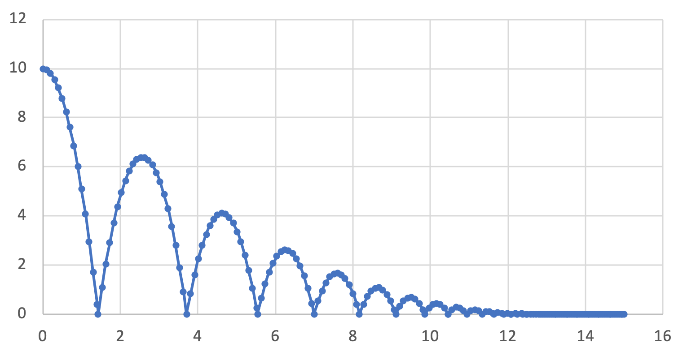

# Introduction

In the simulation of hybrid systems, the continuous state evolution is captured via solving ODEs and the discrete state transitions are detected via zero-crossing events. Conventionally, hybrid systems are modelled using Hybrid Automata (HA), and many existing simulation tools, such as Stateflow/Simulink, OpenModelica, and Ptolemy II, allow the simulation of HA. However, 
they sometimes produce incorrect simulation results due to missing zero-crossing events~\cite{MQSS paper}. This is because their zero-crossing detection algorithms are based on overshooting the guard condition (i.e., detecting the sign change), and it is problematic in some cases~\cite{}.

Higher Order Hybrid Automata (HOHA) is an extension of HA, designed to incorporate higher order ODEs to captrue the continuous dynamics more precisely. Furthermore, the execution of HOHA based on a special step size calculation algorithm that can deal with discontiuities. In particular, the guard conditions are converted into an equivalent Taylor polynomials using the higher order derivatives, and solved for the time of next zero-crossing event. The found time value is then considered for deciding the simulation step size. 

This implementation not only comes with the execution of HOHA, but also the syntactic conversion of the Stateflow/Simulink model (`.mdl`) into HOHA (`.json`). For modelling in Stateflow chart, Matlab/Simulink installation is required. This implementation uses Python3 and Java. 

# <a name="all-in-one"></a> How to run the HOHA simulation (all-in-one command)

Runing the HOHA simulation actually goes through multiple preprocess. For instance, the syntactic translation from stateflow  &rarr; Hybrid Input Output Automata (HIOA) &rarr; HOHA. These can be done in one single all-in-one command.

```
python3 simulation.py <solver> <Time> [config] <FilePath>
```

* solver : two solvers are available, `HOHA` or `MQSS`.
* Time : simulation end time (in seconds)
* FilePath : path to the model file
* config : simulation configuration (optional)

FOr example, the following start the simulation of `example.mdl` model using `HOHA` for 10 seconds 
```
python3 simulation.py HOHA 10 example.mdl
```

Note: the [configuration options](#simulation-configuration) will be described after presenting the bouncing ball example.

Instead of using the all-in-one command, Section [more commands](#more-commands) presents how to separately execute the preprocess and the simulation. (when to run the same simulation again, syntactic conversion is not needed).

## Bouncing Ball Example

Find the boncing ball example in the example folder. Navigate to *example/bouncing_ball/* and double-click the `bouncingBall.mdl` file. If Matlab is correctly installed, this will open Simulink. Alternatively, the file can be opened in Simulink manually. There is a Stateflow chart in the model as shown below:



The variable `x` is the vertical position of the ball, and `v` is the velocity. The initial values are `x=10` and `v=0`.  `v_out` and `x_out` are the output variables, and they have the same value as `v` and `x`, respectively. When `x <= 0` on the transition is satisfied, the velocity is instantaneously changed to `v = -0.8 v`, and the position is `x= 0.001` (to avoid `x=0` re-triggering the transition endlessly). The simulation result of bouncing ball is:



Next, we run the HOHA simulation for the bouncing ball example. On the terminal, run the following command:
```
python3 simulation.py HOHA 15 example/bouncing_ball/bouncingBall.mdl
```

The folder called `generated` contains the generated files for/from the simulation. This includes a `csv` file, which records the values of every variable in each simulation step. Open this file with an editor program such as Excel, and plot the data.
Note that the line from the Simulink simulation perfectly overlaps with this line.



## Simulation configuration

Simulation of HOHA can be configured in two ways. 1) using the commandline flags, 2) modifying the default_setup.json file. 

### Commandline configuration

- HOHA order : -n <value>
- LTE (desired local truncation error) : -v <value>
- Maximum step size : -x <value>

For example, the following command will start the third order HOHA simulation with desired LTE = 0.00001
```
python3 simulation.py HOHA 100 -n 3 -v 0.00001 example.mdl
```

Althernatively, simply open the `default_setup.json` with any text editor you like, and modify the parameters.

### Maximum step size configuration

The purpose of simulation is to generate system traces useful for human to observe and investigate. If the simulation is so perfect such that it can compute the final answer directly from the given initial values, then it will only produce two data points, which are initial values and the final answer. Although the final answer is correct, only two data points are not enough to visualize the traces. For this purpose, the maximum step size option enforces a certain resolution of the simulation visualization. Especially, when the high order HOHA is used, many simulation steps are actualy skipped (because the large step size still ensures the small error), and resulting in the aforementioned problem.

Let us run the bouncing ball example with the fourth order HOHA. The maximum step size is 1 second (default)
```
python3 simulation.py HOHA 15 -n 4 -x 1 example/bouncing_ball/bouncingBall.mdl
```

The plotted graph of the generated `csv` file in the `generated` folder looks like this:



As can be seen, the resolution is very coarse due to small number of steps. In fact, less number of steps are preferrable for the simulation performance, however, too small number of steps are not useful for trace observation. 

Now, try the same simulation with different maximum step size. 

```
python3 simulation.py HOHA 15 -n 4 -x 0.1 example/bouncing_ball/bouncingBall.mdl
```



# More Commands

The all-in-one command is acually a sequence of three other commands. 

- Stateflow &rarr; HIOA
- HIOA &rarr; HOHA
- HOHA simulation

## Stateflow to HIOA conversion

This conversion is done using a `.jar` file. The all-in-one command automatically compiles the java files. Check the file *Sim2HIOA/bin/Sim2HIOA.jar*. If this file does not exist, then open the terminal and execute the command in */Sim2HIOA* location.
```
./automake.sh
```
Then, the following command converts a stateflow model into HIOA.
```
java -jar Sim2HIOA/bin/Sim2HIOA.jar [file_path.mdl]
```
It generates a folder called *generated*, and put a `.json` file that contains the HIOA model.

## HIOA to HOHA conversion

There is a python script file called `conversion.py` under the *HOHA* folder. 
```
python3 HOHA/conversion.py [destination] [HIOA_file] [order]
```
The *destination* is the folder that will contain the generated file, *HIOA_file* is the path of the HIOA model (`.json`), and *order* is the order of HOHA.

For example, 
```
python3 HOHA/conversion.py generated/ bouncing_ball.json 4
```
will geneate the fourth order HOHA model in the generated folder.

## Running the HOHA simulation

Notice that, once the user run the [all-in-one command](#all-in-one).

# Modified Quantized State System (MQSS)

We also implemented Modified Quantized State System (MQSS)~\cite{} as an alternative simulation solver. 


